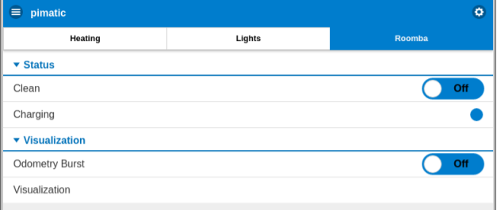

# Roomba odometry visualization
Read delta odometry data from iRobot Roomba Open Interface (ROI) and visualize the integrated position in HTML5.

## System Architecture
* iRobot Roomba 782e.
* ESP 8266 (NodeMCU) reads delta rotation and delta translation from the ROI.
* ESP 8266 sends the odometry data via mqtt to a Raspberry Pi.
* The Raspberry Pi hosts a mqtt broker.
* A node.js visualization server on the Raspberry Pi receives the delta odometry data. It integrates it to a global position and provides an array of positions via html5 websockets.
* A webclient receives the positions via a websocket and visualizes them.
* Pimatic provides the website and is the interface to control the Roomba. Pimatic communicates with the ESP 8266 via mqtt.

## Issues
* I used the Roomba 500 series datasheet for the opcodes. But it seems they are not fully correct. The opcodes to read the delta translation and rotation are swapped (rotation is translation and vice versa).
* When reading the battery capacity (opcode 26) or charge value (opcode 25), the serial communication becomes very unstable with a lot of communication errors. When reading any other data this does not happen.
* I tried using the motion commands, but Roomba 782 never reacted properly. Probably the opcodes slightly changed.

## Pictures

